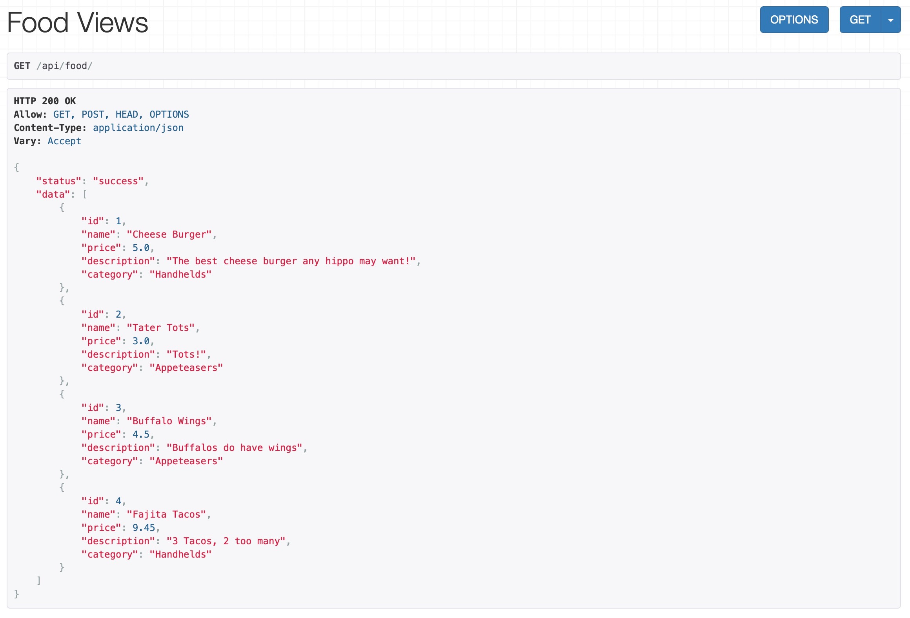
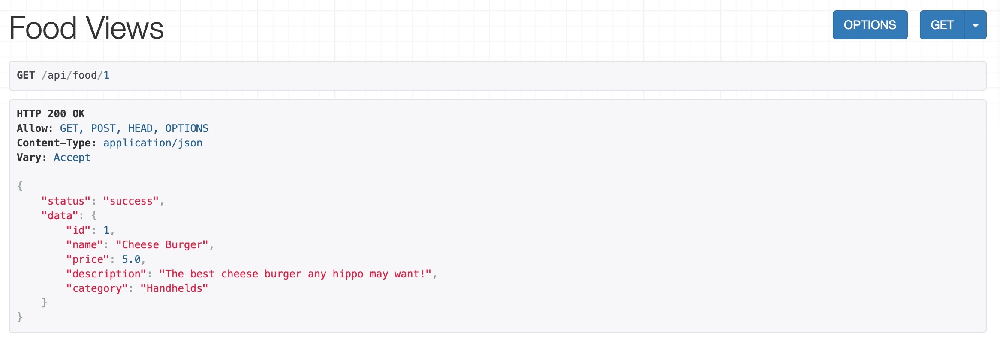
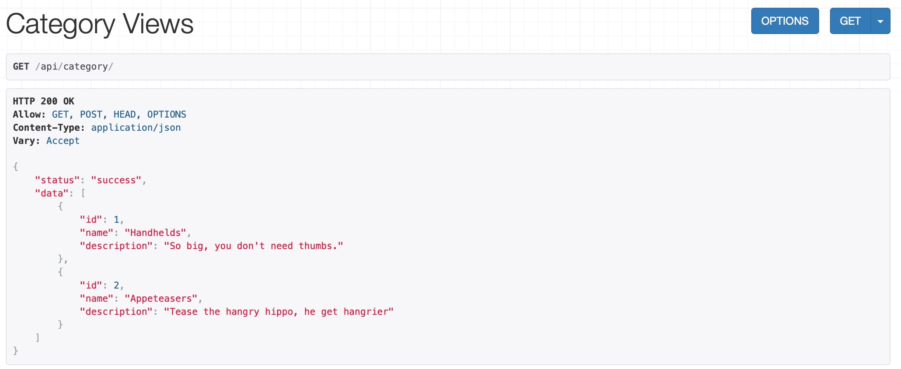
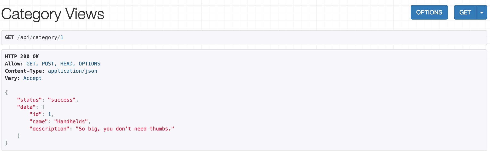
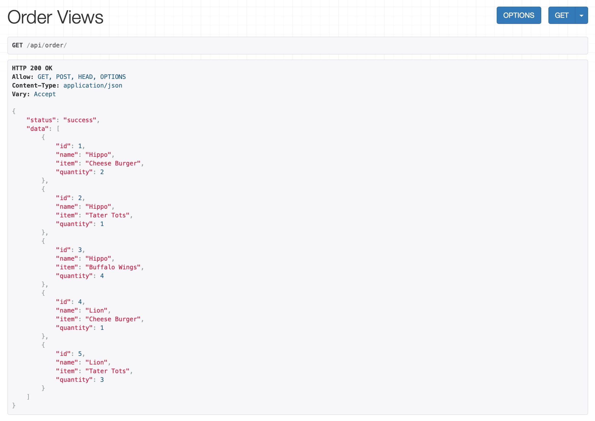
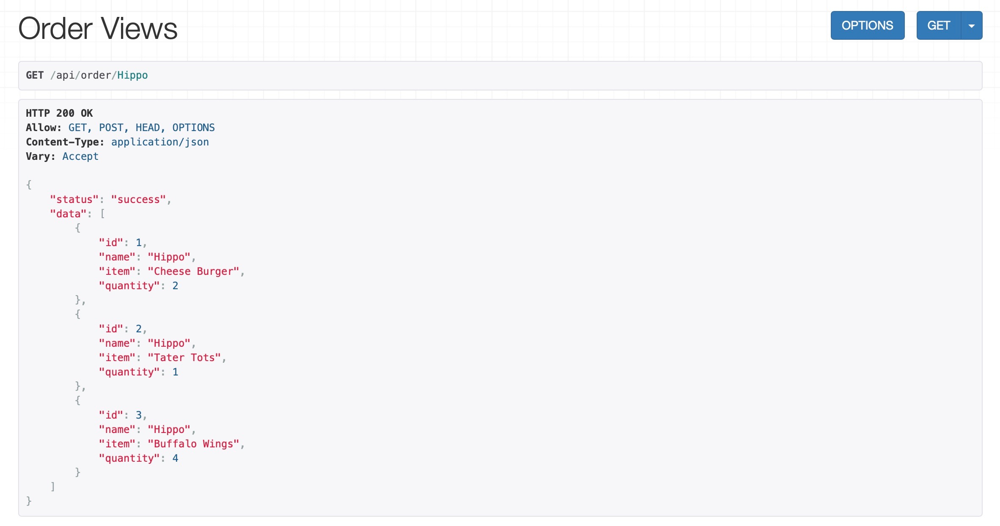
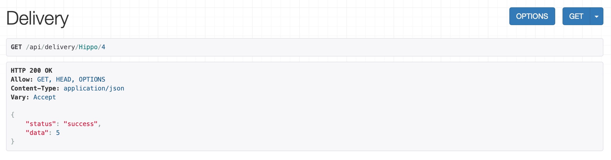
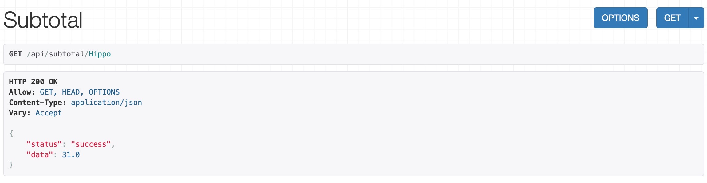
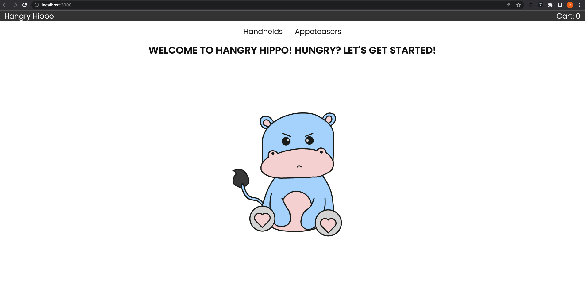

# quantic-test-course

This repository supports the Software Testing Course for the Masters of Software Engineering at [quantic.edu](https://quantic.edu).

## Table of Contents

- [Hangry Hippo - a fictitious company](#hangry-hippo)
- [Requirements](#requirements)
  - [Backend](#backend)
  - [Frontend](#frontend)
- [Local Installation](#local-installation)
  - [Install the Backend](#to-run-the-backend)
  - [Install the Frontend](#to-run-the-frontend)
- Testing
  - [Run Backend Tests](#to-run-backend-unit-tests)
  - [Run Functional Tests](#to-run-frontend-tests)
  - [Run Acceptance Tests](#to-run-end-user-acceptance-tests)
- [More Information about Testing](#more-information-about-testing-in-this-repo)

## Hangry Hippo

Hangry Hippo is a fictitious fast food company. They are developing a new online ordering system.

During the course, we will be developing different types of test cases to verify the online ordering functionality.

## Requirements

The Hangry Hippo application is divided into a Backend and a Frontend. It is preferred, but not required that you have the [git command line interface](https://git-scm.com/downloads) (cli) installed and a [GitHub account](https://github.com/signup).

### Backend

The backend was originally created using [django](https://www.djangoproject.com/) and [djangorestframework](https://www.django-rest-framework.org/). For more information, please read
https://stackabuse.com/creating-a-rest-api-with-django-rest-framework/

The backend requires [Pytho 3.8](https://www.python.org/downloads/). We recommend using a [Python Version Manager](https://realpython.com/intro-to-pyenv/).

### Frontend

The frontend was originally created using [Create-React-App](https://create-react-app.dev/).

The frontend requires [Node 18](https://nodejs.org/en/download/current/). We recommend using [Node Version Manager](https://github.com/nvm-sh/nvm) to manage multiple node versions.

## Local Installation

1.  Clone the repo

        git clone git@github.com:quasifu/quantic-test-course.git

### To run the Backend

1.  Change directory to the backend

        cd backend

2.  Setup a virtual environment.

    > **Note:** `python3 -m venv env` sets up a separate environment where pip can install packages without affecting your global Python installation (if `python3` fails, try `python`).

        python3 -m venv env

3.  Activate the environment

    > **Note:** The `activate` script activates that environment, and your command prompt will change to reflect that you're in the `env` environment. You only need to create the environment once; for subsequent sessions just activate the environment with the `activate` script. To exit the environment, use the `deactivate` command. You can learn more about the `venv` module [here](https://docs.python.org/3/library/venv.html).

    Windows:

        source env/bin/activate

    Mac/Linux:

        . env/bin/activate

4.  Install the dependencies

        pip install

5.  Run the server

    > **Note:** If the current working directory isn't included in your OS's PATH environment variable, you'll need to prepend it to the command like so: `.\manage.py runserver` (for Windows) `./manage.py runserver` (for macOS/Linux).

          ./manage.py runserver

6.  Verify the server is running by accessing the following API's.

    - http://127.0.0.1:8000/api/food/

      

    - http://127.0.0.1:8000/api/food/1

      

    - http://127.0.0.1:8000/api/category/

      

    - http://127.0.0.1:8000/api/category/1

      

    - http://127.0.0.1:8000/api/order/

      

    - http://127.0.0.1:8000/api/order/Hippo

      

    - http://127.0.0.1:8000/api/delivery/Hippo/4

      

    - http://127.0.0.1:8000/api/subtotal/Hippo

      

### To run backend unit tests

1.  Install the test dependencies

        pip install pytest django_mock_queries six

2.  Run the tests

    > **Note:** The server shouldn't be running when you run tests.

        pytest

3.  You should see something like the screen below

        ================= test session starts ===================
        platform linux -- Python 3.8.13, pytest-7.1.2, pluggy-1.0.0
        rootdir: ./quantic-test-course/backend/hangry_api
        collected 5 items

        tests/test_DeliveryCost.py ...                     [ 60%]
        tests/test_SubtotalCost.py ..                      [100%]
        ================= 5 passed in 0.16s =====================

### To run the frontend

1.  Change directory to the frontend

        cd frontend

2.  Install dependencies

        npm install

3.  Run the server

        npm run start

4.  A new browser window will open Hangry Hippo at http://localhost:3000

    

5.  [Optional] to use the local backend apis, make sure both servers (frontend and backend) are running. Then, update ./frontend/src/utils/constants.js

    Replace this line:

        export const API_URL = 'http://hangry-api-dev.us-east-1.elasticbeanstalk.com';

    With this line:

        export const API_URL = 'http://localhost:8000';

### To run frontend tests

1.  Run the tests from the `frontend` folder

        npm test

2.  You should see something like...

         PASS  src/pages/Home/Home.test.js
         PASS  src/App.test.js
         Test Suites: 2 passed, 2 total
         Tests:       3 passed, 3 total
         Snapshots:   0 total
         Time:        2.715 s, estimated 3 s
         Ran all test suites.

### To run End User Acceptance tests

1.  Run Cypress from the `frontend` folder

        node_modules/.bin/cypress run

2.  Verify that the tests were run. You should see something like..

        ==============================================
        (Run Starting)
        ┌─────────────────────────────────────────────┐
        │ Cypress:        10.3.0                      │
        │ Browser:        Electron 100 (headless)     │
        │ Node Version:   v18.5.0                     │
        │ Specs:          1 found (spec.cy.js)        │
        │ Searched:       cypress/e2e/**/*.cy.{js,jsx}│
        └─────────────────────────────────────────────┘
        ───────────────────────────────────────────────

        Running:  spec.cy.js                   (1 of 1)

        Hits Home Page
        ✓ passes (772ms)
        ✓ displays the Welcome message (76ms)

        Hits Order Page
        ✓ passes (426ms)
        ✓ shows Your Order title (109ms)

        4 passing (4s)

        (Results)

        ┌────────────────────────────────────────────┐
        │ Tests:        4                            │
        │ Passing:      4                            │
        │ Failing:      0                            │
        │ Pending:      0                            │
        │ Skipped:      0                            │
        │ Screenshots:  0                            │
        │ Video:        true                         │
        │ Duration:     3 seconds                    │
        │ Spec Ran:     spec.cy.js                   │
        └────────────────────────────────────────────┘

        (Video)

          -  Started processing:  Compressing to 32 CRF
          -  Finished processing: /quantic-test-course/frontend/cypress/videos/spec.cy.js.mp4     (2 seconds)

        ===============================================

        (Run Finished)

        Spec             Tests  Passing  Failing  Pending  Skipped
        ┌─────────────────────────────────────────────────────────┐
        │ ✔spec.cy.js(00:03) 4      4        -        -         - │
        └─────────────────────────────────────────────────────────┘
          ✔All specs passed! 4      4        -        -        -

3.  [Optional] To watch the automated acceptance test run, open the video located at

        /frontend/cypress/videos/spec.cy.js.mp4

4.  [Optional] To run the tests using the Cypress application, open cypress using

        node_modules/.bin/cypress open

## More Information about Testing in this Repo

### Unit Testing

Unit testing is implemented in the `backend` using [pytest](https://docs.pytest.org/en/7.1.x/getting-started.html).

### Functional Testing

Functional testing is implemented in the `frontend` for the `Home` page using [jest](https://jestjs.io/).

### Acceptance Testing

Acceptance tests are implemented in the `frontend` for `Home` and `Order` pages using [cypress](https://www.cypress.io/).

### Security Testing

Security testing is implemented in the `frontend` using [ZAP](https://owasp.org/www-project-zap/). For more information on security testing, visit [OWASP](https://owasp.org/).

### Automated Testing

All of the tests are automated into the CI/CD pipeline using [GitHub Actions](https://github.com/features/actions). GitHub Actions are defined in this repository in the `.github/workflows` folder. Feel free to view the automated runs under the [Actions](https://github.com/quasifu/quantic-test-course/actions) tab of this repository.

&copy; 2022 Quantic School of Business and Technology
